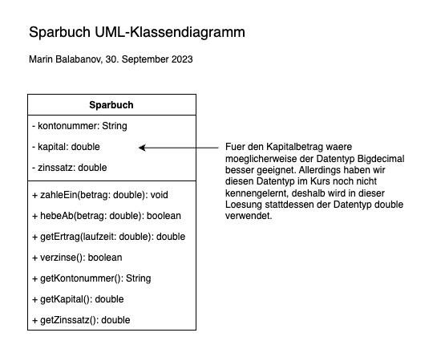

# Sparbuch mit Zinsberechnung

Das Sparbuch ist eine Anlageform, die ueber eine Kontonummer verfuegt und einen Kapitalbetrag enthalten kann.

Man kann den Kontostand und die Kontonummer abrufen, einen Betrag einzahlen, der den angelegten Kapitalbetrag erhoeht und einen Betrag abheben, der den Kapitalbetrag reduziert.

Man kann den moeglichen Ertrag mit Zins und Zinseszins nach einer Laufzeit berechnen und das Kapital mit dem Jahreszinssatz verzinsen. 

